In this blog post, we'll explore how to containerize a full-stack application using Docker. We'll start with an introduction to Docker and gradually move towards containerizing our application into multiple containers.

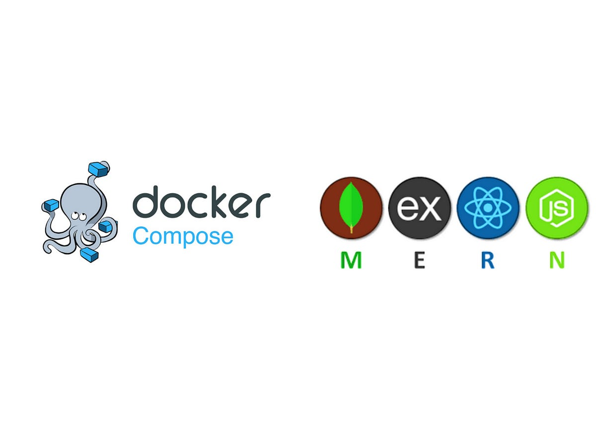{:height="350px" width="700px"}

<!-- ## Table of Contents 📑

1. [Introduction](#introduction)
2. [Prerequisites](#prerequisites)
3. [Getting Started: Setting Up a MERN Application](#getting-started)
4. [Containerizing the Presentation Layer (Frontend)](#containerizing-the-presentation-frontend)
5. [Containerizing the Application Logic Layer (Backend)](#containerizing-the-application-logic-layer-backend)
6. [Containerizing the Data Storage Layer (Database)](#containerizing-the-data-storage-layer-database)
7. [Creating Docker Compose for Multi-Container Deployment](#creating-docker-compose-for-multi-container-deployment)
8. [Running and Testing the Application](#running-and-testing-the-application)
9. [Conclusion](#conclusion)
10. [Additional Tips and Resources](#additional-tips-and-resources) -->

## Introduction 🌟 

In today's digital landscape, deploying and managing complex applications can be challenging. Docker, a powerful containerization platform, offers a streamlined approach to packaging, distributing, and running applications. In this tutorial, we'll explore how Docker can simplify the deployment of a 3-tier application—a common architecture consisting of a presentation layer (frontend), an application logic layer (backend), and a data storage layer (database).

## Prerequisites 📋

Before we begin, ensure you have the following prerequisites:

- **Docker:** Install Docker on your machine if you haven't already. You can download and install Docker Desktop from [here](https://www.docker.com/products/docker-desktop/).
- **Node.js and npm:** Ensure [Node.js](https://nodejs.org/en) and [npm](https://docs.npmjs.com/downloading-and-installing-node-js-and-npm) (Node Package Manager) are installed on your system to set up the MERN (MongoDB, Express.js, React, Node.js) stack locally.
- **Text Editor:** Choose a text editor or IDE (Integrated Development Environment) of your choice for writing and editing code. Recommended editors include Visual Studio Code, Sublime Text, or Atom.
- **Basic Understanding of Docker:** Familiarize yourself with Docker concepts such as containers, images, Dockerfiles, and Docker Compose. You can refer to the official Docker documentation for an overview.

## Getting Started: Setting Up a MERN Application 🛠️

Before Dockerizing your MERN (MongoDB, Express.js, React, Node.js) application, ensure you have a basic MERN stack application set up locally. If you don't already have a MERN app, follow these [blog](https://medium.com/@sriram.se21/step-by-step-tutorial-building-a-mern-stack-application-from-scratch-d281010715e4) to create a simple example (ToDoApp).

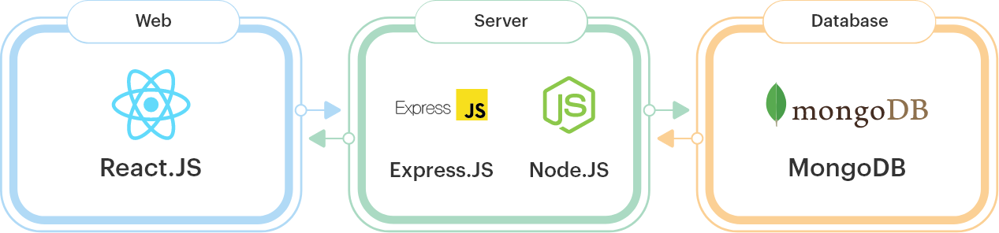

## Containerizing the Presentation Layer (Frontend) 🖼️

In this section, we'll containerize the presentation layer of our 3-tier application:

- **Dockerfile for Installing Dependencies in a React Frontend**
    - *Create a Dockerfile for the front-end in the root directory of your React Frontend folder.*
    - *Install necessary dependencies within the Dockerfile.*
    - *Copy the source code into the Docker image.*
    - *Expose the required ports for accessing the front-end.*
    

    ```dockerfile
    FROM node:latest
    WORKDIR /app
    COPY package.json .
    RUN npm install
    COPY . .
    EXPOSE 3000
    CMD [ "npm", "start" ]
    ```

- **Let's take a look at what each line does:**
1. **FROM node:latest:** Specifies the base image as the latest version of Node.js available on Docker Hub.
2. **WORKDIR /app:** Sets the working directory inside the container to /app, which will be the location for all subsequent commands.
3. **COPY package.json .:** Copies the package.json file from the host machine (where the Docker build is initiated) into the container's /app directory.
4. **RUN npm install:** Executes npm install within the container to install dependencies specified in package.json. This step ensures all required Node.js modules are installed in the container.
5. **COPY . .:** Copies all files and directories from the host machine's current directory (where the Dockerfile is located) into the container's /app directory. This includes the application code.
6. **EXPOSE 3000:** Documents that the container will listen on port 3000 at runtime. It does not actually publish the port.
7. **CMD ["npm", "start"]:** Specifies the default command to run when the container starts. In this case, it runs npm start, assuming that there is a corresponding start script defined in the package.json file for starting the Node.js application.

- **Building and Running the Docker Image 🐳**

    - *To build and run the Docker image based on the above Dockerfile:*

    *1. Build the Docker Image:*

    ```bash
    # Replace my-react-app-frontend with your desired image name.
    docker build -t my-react-app-frontend .
    ```

    *2. Run the Docker Container:*

    ```bash
    # This command starts a Docker container based on the my-react-app-frontend image, exposing port 3000 on the host machine.
    docker run -d -p 3000:3000 my-react-app-frontend
    ```

- **Accessing the Dockerized Frontend Application 🌐**

    - *<b>Open a Web Browser:</b> After running the Docker container, open a web browser on your local machine.*

    - *<b>Navigate to the Application URL:</b> In the web browser's address bar, enter the following URL*
    ```hack
    http://localhost:3000
    # This URL corresponds to the exposed port (typically port 3000) where the Dockerized frontend application is accessible.
    ```

    - *<b>Interact with the Application:</b> Once the application loads in the web browser, interact with it as you would with any frontend application. Test different features, navigate through pages, and verify that the application functions correctly.*

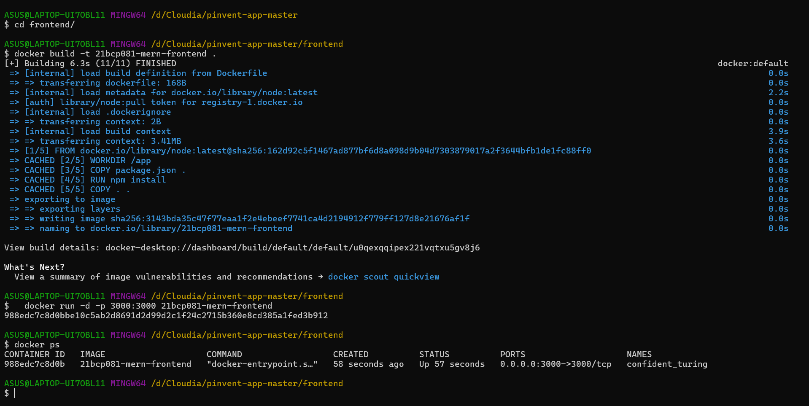

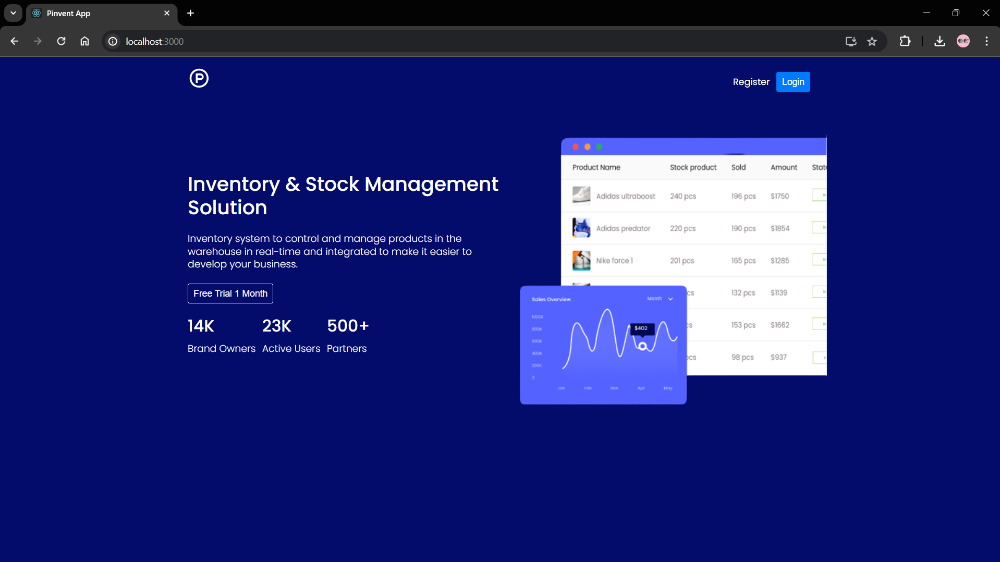

## Containerizing the Application Logic Layer (Backend) ⚙️

Next, let's Dockerize the backend or application logic layer:
- **Dockerfile for Installing Dependencies in a React Backend**
    - *Set up a Dockerfile for your backend server (e.g., Node.js, Django, Spring Boot).*
    - *Install dependencies using package managers like npm or pip.*
    - *Copy the backend source code into the Docker image.*
    - *Expose endpoints or APIs required for communication with the presentation layer.*

    
    ```dockerfile
    FROM node:latest
    WORKDIR /app
    COPY package.json .
    RUN npm install
    COPY . .
    EXPOSE 5000
    CMD [ "npm", "start" ]
    ```

    *I have shown details of all the commands in the [Frontend](#containerizing-the-presentation-layer-frontend) section please refer to the same.*

- **Building and Running the Docker Image 🐳**

    - *To build and run the Docker image based on the above Dockerfile:*

    *1. Build the Docker Image:*

    ```bash
    # Replace my-react-app-backend with your desired image name.
    docker build -t my-react-app-backend .
    ```

    *2. Run the Docker Container:*

    ```bash
    # This command starts a Docker container based on the my-react-app-backend image, exposing port 5000 on the host machine.
    docker run -d -p 5000:5000 my-react-app-backend
    ```

- **Accessing the Dockerized Backend Application 🌐**

    - *<b>Open a Web Browser:</b> After running the Docker container, open a web browser on your local machine.*

    - *<b>Navigate to the Application URL:</b> In the web browser's address bar, enter the following URL*
    ```hack
    http://localhost:5000
    # This URL corresponds to the exposed port (typically port 5000) where the Dockerized Backend application is accessible.
    ```

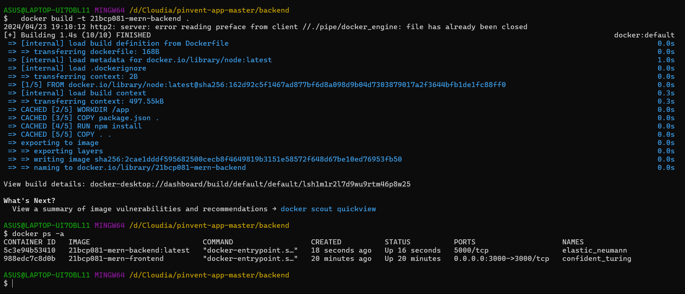


## Containerizing the Data Storage Layer (Database) 🗃️

Now, deploy the data storage layer using Docker:

- *Pull and run an official database image (e.g., MySQL, PostgreSQL) from Docker Hub.*
- *Configure volumes to persist data outside the container.*
- *Set environment variables for database configuration.*

    ```bash
    docker run -d --name my-mongodb -p 27017:27017 \
    -e MONGO_INITDB_ROOT_USERNAME=admin \
    -e MONGO_INITDB_ROOT_PASSWORD=adminpassword \
    -e MONGO_INITDB_DATABASE=mydatabase \
    -v /path/on/host:/data/db \
    mongo:latest
    ```
- **Explanation of the command:**
1. **-d:** Run the container in detached mode (in the background).
2. **--name my-mongodb:** Assign a name (my-mongodb) to the container for easy reference.
3. **-p 27017:27017:** Expose port 27017 on the host machine to access MongoDB.
4. **-e MONGO_INITDB_ROOT_USERNAME=admin and -e MONGO_INITDB_ROOT_PASSWORD=adminpassword:** Set environment variables for the MongoDB root user. Replace admin and adminpassword with your desired username and password.
5. **-e MONGO_INITDB_DATABASE=mydatabase:** Specify the name of the initial database (mydatabase) to be created on MongoDB startup.
6. **Local Database Path:** Replace /path/on/host with the absolute path on the host machine where you want to persist MongoDB data.

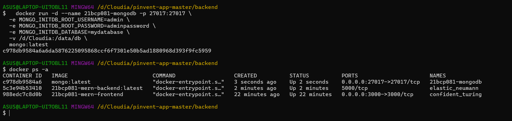

## Creating Docker Compose for Multi-Container Deployment 🐋

Let's orchestrate our multi-container application with Docker Compose:

- *Define a docker-compose.yml file to specify services for the presentation, backend, and database layers.*
- *Configure networking and dependencies between containers using Docker Compose.*
- *Specify environment variables and volume mounts in the Docker Compose file.*

To orchestrate a multi-container application using Docker Compose, you can define a docker-compose.yml file that specifies services for the presentation (frontend), backend, and database layers. This configuration will also set up networking, dependencies between containers, and specify environment variables and volume mounts. Below is an example docker-compose.yml file for a typical MERN (MongoDB, Express.js, React, Node.js) stack application.

- **Example docker-compose.yml for Multi-Container Deployment**
    ```yml
    version: "3"

    services:
    frontend:
        build: ./frontend   # Build the frontend service using the Dockerfile in the ./frontend directory
        container_name: react-app   # Custom container name for the frontend service
        ports:
        - "3000:3000"   # Map port 3000 on host to port 3000 in container
        depends_on:
        - backend   # Ensure backend service is started before frontend
        networks:
        - mern-network   # Connect frontend service to mern-network

    backend:
        build: ./backend   # Build the backend service using the Dockerfile in the ./backend directory
        container_name: node-api   # Custom container name for the backend service
        ports:
        - "5000:5000"   # Map port 5000 on host to port 5000 in container
        depends_on:
        - database   # Ensure database service is started before backend
        environment:
        MONGODB_URI: mongodb://database:27017/mydatabase   # MongoDB connection URI
        networks:
        - mern-network   # Connect backend service to mern-network

    database:
        image: mongo:latest   # Use the latest MongoDB image from Docker Hub
        container_name: mongo-db   # Custom container name for the MongoDB service
        ports:
        - "27017:27017"   # Map port 27017 on host to port 27017 in container
        volumes:
         -  mongodb-data:/data/db   # Mount a volume to persist MongoDB data
        networks:
        - mern-network   # Connect database service to mern-network

    networks:
    mern-network:   # Define a custom bridge network for communication between services
        driver: bridge

    volumes:
    mongodb-data:   # Define a named volume for MongoDB data persistence
    ```

- **Explanation of docker-compose.yml Configuration**

    - **Services:**
        - **frontend:**
            - **build: ./frontend:** Specifies the path to the frontend application's directory containing a Dockerfile for building the frontend service.
            - **container_name: react-app-frontend:** Sets a custom container name (react-app) for the frontend service.
            - **ports: ["3000:3000"]:** Maps port 3000 on the host machine to port 3000 in the frontend container for accessing the frontend application.
            - **depends_on: - backend:** Defines a dependency on the backend service, ensuring the backend service starts before the frontend service.
            - **networks: - mern-network:** Connects the frontend service to the custom bridge network mern-network for inter-service communication.
        - **backend:** Similar configuration to frontend but for the backend service.
            - **environment: MONGODB_URI:**mongodb://database:27017/mydatabase: Sets the MONGODB_URI environment variable to specify the MongoDB connection URI, using the service name database as the hostname within the Docker network.
        - **database:**
            - **image: mongo:latest:** Uses the latest MongoDB image from Docker Hub.
            - **container_name: mongo-db:** Sets a custom container name (mongo-db) for the MongoDB service.
            - **ports: ["27017:27017"]:** Maps port 27017 on the host machine to port 27017 in the MongoDB container for accessing MongoDB.
            - **volumes: - mongodb-data:/data/db:** Mounts a named volume (mongodb-data) to persist MongoDB data outside the container.
        - **Networks:**
            - **mern-network:** Defines a custom bridge network (mern-network) for communication between services.
        - **Volumes:**
            - **mongodb-data:** Defines a named volume (mongodb-data) for persisting MongoDB data.


## Running and Testing the Application 🧪

It's time to run our Dockerized 3-tier application:

To run and test your Dockerized 3-tier application, which includes frontend, backend, and database layers orchestrated with Docker Compose, follow these steps to start the application stack, access it via a web browser, and test its functionality across different layers.

**1. Start the Application Stack with Docker Compose**

Ensure you are in the directory containing your `docker-compose.yml` file, which defines the services for your application stack. Use the following command to start the entire stack:

```bash
docker-compose up -d
```

The `-d` flag runs the services in detached mode, allowing them to run in the background.

**2. Verify Containers are Running**

After starting the application stack, verify that the Docker containers are running using the following command:

```bash
docker-compose ps
```

This command displays the status of containers defined in your `docker-compose.yml` file.

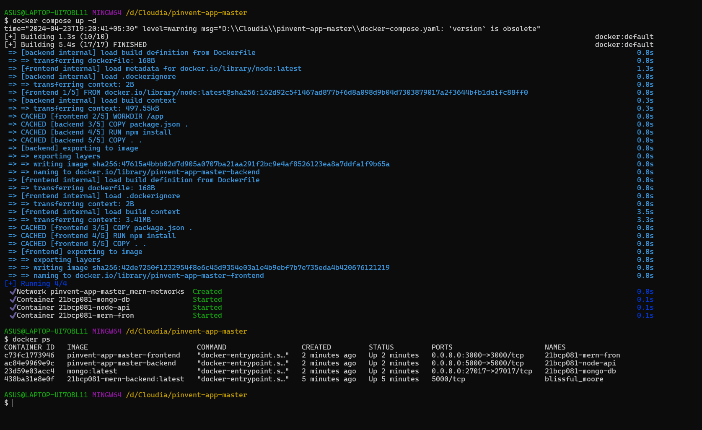

**3. Access the Application via Web Browser**

Open a web browser and navigate to the frontend application's URL to access your Dockerized application. Assuming your frontend service is exposed on port `3000` (as per the example), use:

```
http://localhost:3000
```

Replace `3000` with the mapped port defined in your `docker-compose.yml` file for the frontend service.

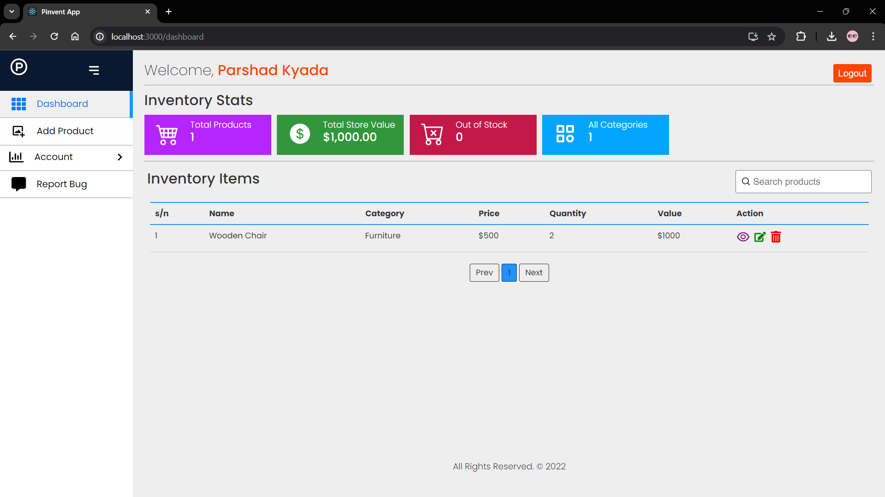

**4. Test Functionality Across Different Layers**

- **Frontend Testing:**
    - Interact with the frontend application in the web browser to test its functionality.
    - Verify that the frontend can communicate with the backend using API calls (e.g., fetching data, submitting forms).

    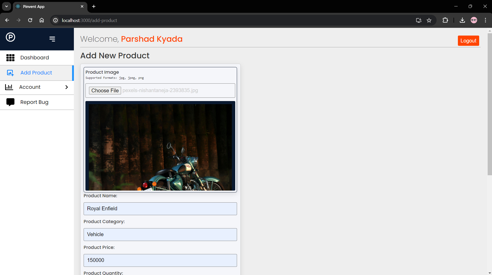


- **Backend Testing:**
    - Monitor backend logs using Docker commands (`docker logs <backend-container-id>`) to debug and verify backend functionality.
    - Use tools like Postman or curl to directly test backend APIs if needed.

    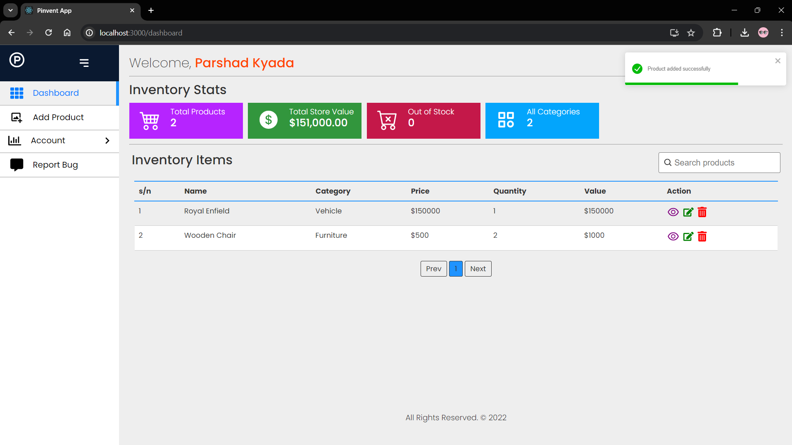

- **Database Testing:**
    - Connect to the database using a database client tool (e.g., MongoDB Compass for MongoDB) to verify data persistence and integrity.
    - Check database logs (`docker logs <database-container-id>`) for any errors or warnings related to database operations.

    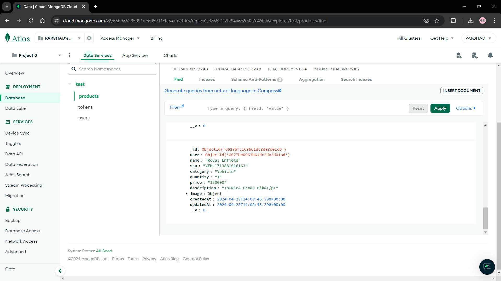

**Stopping the Application Stack**

To stop and remove the running containers defined in the `docker-compose.yml` file, use the following command:

```bash
docker-compose down
```

This command stops and removes the containers, networks, and volumes created by the `docker-compose up` command. 

Additional Screen-Shots of Docker Decktop.

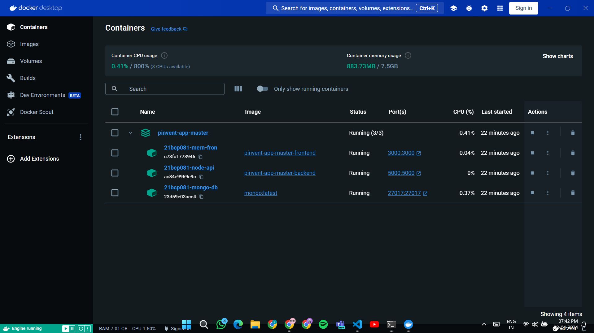

## Conclusion 🌈

In conclusion, containerizing a 3-tier application with Docker offers significant advantages in terms of deployment simplicity, scalability, and resource efficiency. By encapsulating each layer of the application—frontend, backend, and database—into separate Docker containers, developers can easily manage dependencies, replicate environments, and ensure consistency across different deployment environments.

Throughout this tutorial, we've explored the step-by-step process of Dockerizing a MERN (MongoDB, Express.js, React, Node.js) stack application:

1. **Setting up a MERN Application Locally**:
   - Ensured prerequisites were met, including Docker installation and basic understanding of Docker concepts.

2. **Containerizing the Presentation Layer (Frontend)**:
   - Created Dockerfiles to package and run the React frontend application within a Docker container.
   - Demonstrated how to build and run the Docker image, exposing the frontend on a specified port.

3. **Containerizing the Application Logic Layer (Backend)**:
   - Similarly Dockerized the Node.js backend, including installing dependencies and exposing necessary endpoints.

4. **Deploying the Data Storage Layer (Database)**:
   - Deployed a MongoDB database using an official Docker image, configured with environment variables and persistent data storage.

5. **Orchestrating Multi-Container Deployment with Docker Compose**:
   - Defined services for each layer (frontend, backend, database) in a `docker-compose.yml` file.
   - Specified networking, dependencies, and environment settings for seamless inter-container communication.

6. **Running and Testing the Dockerized Application**:
   - Started the entire application stack using Docker Compose, accessed the frontend and backend via web browsers, and tested functionality across layers.

By following these steps, developers can streamline the deployment process, foster collaboration among teams, and leverage Docker's ecosystem for continuous integration and delivery (CI/CD) pipelines.

As you continue your journey with Docker and containerization, remember to explore additional best practices such as environment variable management, logging, monitoring, and security enhancements. Docker's versatility empowers developers to build, ship, and run applications efficiently in diverse environments, from local development setups to scalable production deployments.

Containerization with Docker represents a fundamental shift in modern application development, offering unparalleled flexibility and scalability. Embrace the power of Docker to simplify complex deployments and unlock new possibilities for your software projects.

Start containerizing your applications today and experience the transformative benefits of Docker firsthand. Happy coding! 🐳   

## Additional Tips and Resources 📚

Certainly! Here are some additional tips and resources to further explore Docker and optimize your containerized applications:

### Tips for Optimizing Docker Configurations

1. **Use Multi-Stage Builds**:
   Improve build efficiency and reduce image size by leveraging multi-stage builds in your Dockerfiles. This helps separate build dependencies from runtime dependencies.

2. **Optimize Docker Images**:
   Minimize image size by removing unnecessary packages and files. Use lightweight base images (e.g., Alpine Linux) where possible.

3. **Utilize Docker Health Checks**:
   Implement health checks in your Docker containers to monitor the status of running services and automatically restart unhealthy containers.

4. **Manage Docker Resources**:
   Configure resource limits (CPU, memory) for Docker containers to optimize performance and prevent resource contention.

### Exploring Advanced Docker Features

1. **Container Orchestration**:
   Dive into container orchestration tools like Kubernetes, Docker Swarm, or Nomad for managing, scaling, and deploying containerized applications in production environments.

2. **Service Discovery and Load Balancing**:
   Learn about service discovery mechanisms and load balancing strategies to efficiently distribute traffic across multiple container instances.

3. **Docker Networking**:
   Explore advanced Docker networking concepts such as overlay networks, network policies, and secure communication between containers.

### Recommended Resources

1. **Official Docker Documentation**:
   The Docker documentation is an excellent resource for learning about Docker features, best practices, and troubleshooting:
   - [Docker Documentation](https://docs.docker.com/)

2. **Docker Official Blog**:
   Stay updated with the latest Docker news, tutorials, and case studies by following the Docker blog:
   - [Docker Blog](https://www.docker.com/blog/)

3. **Docker Official GitHub Repository**:
   Explore Docker's source code, contribute to open-source projects, and discover community-driven tools and extensions:
   - [Docker GitHub Repository](https://github.com/docker)

4. **Online Courses and Tutorials**:
   Enroll in Docker courses on platforms like Udemy, Coursera, or Pluralsight to deepen your knowledge of Docker concepts and practices.

5. **Community Forums and Discussions**:
   Engage with the Docker community on forums like Docker Community Forums or Stack Overflow to ask questions, share insights, and collaborate with other Docker enthusiasts.

### Getting Started with Advanced Docker Topics

If you're ready to explore more advanced Docker topics, consider diving into container orchestration with Kubernetes or mastering Docker networking and security features. These skills are valuable for deploying and managing containerized applications at scale in production environments.

By leveraging these resources and tips, you'll enhance your proficiency in Docker and unlock new possibilities for building and deploying modern, scalable applications. If you have specific areas of interest or need guidance on a particular Docker topic, feel free to reach out for personalized assistance. Happy containerizing! 🐳🚀